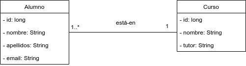

# Ejemplo 15 - Ejemplo de dos entidades con una asociación ManyToOne

Continuamos desde el [ejemplo 13](https://github.com/lmlopezmagana/bbdd-2019/tree/master/13_CrudCompletoUnaEntidad3)

## ¿Qué tenemos ya hecho?

Ya tenemos creada una entidad, así como su repositorio, un servicio y un controlador con algunos métodos.

## ¿Qué vamos a crear?

1. Una nueva entidad, que está asociada con la anterior.
2. La asociación entre ambas entidades.

## ¿Cuál es nuestro modelo de datos?

 

## Algo de teoría sobre asociaciones _ManyToOne_

Una asociación _muchos-a-uno_ es una asociación que relaciona dos clases, de forma que una instancia del lado _uno_ (en nuestro caso, curso), puede asociarse con varias instancias del lado _muchos_, (en nuestro caso, los alumnos).

Para poder implementar esto en nuestra aplicación necesitamos:

1. Trasladar la entidad del lado _muchos_.
2. Trasladar la entidad del lado _uno_.
3. Añadir los elementos necesarios para implementar la asociación.

### ¿Cómo impacta esto en el resto de nuestro sistema?

Como norma general:

- La entidad del lado _muchos_ tendrá su repositorio y su servicio.
- La entidad el lado _uno_ también tendrá su repositorio y su servicio.


## Paso 1: Creamos la segunda entidad

Es muy parecida a la que ya tenemos creada

```java
@Entity
public class Curso {
	
	@Id
	@GeneratedValue(strategy=GenerationType.AUTO)
	private long id;
	
	private String nombre;
	private String tutor;
	
	public Curso(String nombre, String tutor) {
		this.nombre = nombre;
		this.tutor = tutor;
	}	
}

```


## Paso 2: Creamos el repositorio y servicio para esta entidad

```java
public interface CursoRepository 
		extends JpaRepository<Curso, Long> {

}
```

```java
@Service
public class CursoServicio {

	// Inyectamos la dependencia al nuevo estilo, sin @Autowired
	private CursoRepository cursoRepository;
	
	public CursoServicio(CursoRepository repo) {
		this.cursoRepository = repo;
	}
	
	public Curso add(Curso c) { return cursoRepository.save(c); }
	
	public Curso edit(Curso c) { return cursoRepository.save(c); }

	public void delete(Curso c) { cursoRepository.delete(c); }
	
	public void delete(long id) { cursoRepository.deleteById(id); }
	
	public List<Curso> findAll() { return cursoRepository.findAll(); }
	
	
	public Curso findById(long id) {
		return cursoRepository.findById(id).orElse(null);
	}
		
}

```

## Paso 3: Modificación de la clase `Alumno` para registrar la asociación entre clases

Para añadir los elementos necesarios para poder registrar la asociación entre ambas clases tenemos que modificar nuestra clase `Alumno`. Necesitamos saber, para cada instancia de `Alumno`, cual es su instancia de `Curso` correspondiente. Por tanto, tenemos que añadir una propiedad a la primera clase, de este segundo tipo.

```java
@Entity
public class Alumno {
	
	@Id
	@GeneratedValue(strategy=GenerationType.AUTO)
	private long id;
	
	private String nombre;
	private String apellidos;
	private String email;
	
	private Curso curso;
}
```

**Sin embargo, esto por sí solo no es suficiente**. JPA (en nuestro caso, Spring Data JPA) nos pide que identifiquemos esta asociación, para que la traslade al DDL (si corresponde) y la pueda manejar. Todo ello lo conseguimos a través de la anotación `@ManyToOne`.

El código, finalmente, quedaría así:

```java
@Entity
public class Alumno {
	
	@Id
	@GeneratedValue(strategy=GenerationType.AUTO)
	private long id;
	
	private String nombre;
	private String apellidos;
	private String email;
	
	@ManyToOne
	private Curso curso;
	
	public Alumno(String nombre, String apellidos, String email) {
		this.nombre = nombre;
		this.apellidos = apellidos;
		this.email = email;
	}

	public Alumno(String nombre, String apellidos, String email, Curso curso) {
		this.nombre = nombre;
		this.apellidos = apellidos;
		this.email = email;
		this.curso = curso;
	}

}

```

Si ejecutamos el proyecto, podemos apreciar el DDL generado

```sql
create table alumno (
	id bigint not null, 
	apellidos varchar(255), 
	email varchar(255), 
	nombre varchar(255), 
	curso_id bigint, 
	primary key (id)
);

create table curso (
	id bigint not null, 
	nombre varchar(255), 
	tutor varchar(255), primary key (id)
);

alter table alumno 
add constraint FKojks48ahsqwkx9o2s7pl0212p 
foreign key (curso_id) references curso;
```

Podemos apreciar como:

- Se añade un nuevo atributo, llamado `curso_id`, cuyo tipo es el mismo que el del Id de `Curso`.
- Se añade también una restricción de clave externa para este atributo.

## ¿Qué faltaría?

Nos faltaría implementar la parte de interfaz de usuario correspondiente:

- Un listado de todas los cursos, con sus correspondientes botoneras de opciones (editar y borrar).
- Un formulario de creación y edición de cursos.
- Modificar el formulario de creación/edición de Alumnos, para incluir el _atributo relacional curso_.