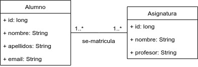

# Ejemplo 19 - Ejemplo de dos entidades con una asociación ManyToMany (tratamiento bidireccional)

Partimos desde el ejemplo [anterior](https://github.com/lmlopezmagana/bbdd-2019/tree/master/18_AsociacionesManyToMany-Uni)

## ¿Cuál es nuestro modelo de datos?

 

## Tratamiento bidireccional de una asociación `@ManyToMany`

El tratamiento _bidireccional_ de una asociación nos permite utilizar dicha asociación desde las dos entidades que están conectadas. Partimos del código del ejemplo anterior:

```java
@Entity
public class Asignatura {

	// Resto de código
	
	@ManyToMany
	@JoinTable(
		joinColumns = @JoinColumn(name="asignatura_id"),
		inverseJoinColumns = @JoinColumn(name="alumno_id")
	)
	private List<Alumno> alumnos = new ArrayList<>();
	
	// Resto de código
	
}

```

Con esto, hemos visto que es suficiente para manejar la asociación. Pero, ¿y si queremos conocer (o manejar) la lista de asignaturas de un `Alumno`?

Para hacerlo, tendríamos que utilizar la misma anotación `@ManyToMany` en la entidad _de enfrente_, es decir, en `Alumno`.

Veamoslo paso a paso.


## Paso 1: Modificar la entidad alumno

```java
@Entity
public class Alumno {
	
	// Resto de código
	
	@ManyToMany(mappedBy="alumnos")
	private List<Asignatura> asignaturas = new ArrayList<>();
	
	// Resto de código

}

```

El atributo `mappedBy` nos permite indicar que la asociación ya está definida en otra entidad, y que este lado es _complementario_ (para que no vuelva a crear todo el DDL; tan solo lo aprovechará).

## Paso 2: Añadir los métodos _helpers_

Al igual que en el tratamiento bidireccional de las asociaciones `@OneToMany`, para hacer un tratamiento bidireccional de una asociación `@ManyToOne` también necesitamos manejar la asociación en ambos extremos, por lo que nos serviremos de un par de métodos que lo harán por nosotros.

Como en el ejemplo anterior decidimos, de alguna manera, que el lado `Asignatura` era el _propietario_ de la asociación, será donde añadamos los métodos.

```java
@Entity
public class Asignatura {


	// Resto del código
	
	@ManyToMany
	@JoinTable(
		joinColumns = @JoinColumn(name="asignatura_id"),
		inverseJoinColumns = @JoinColumn(name="alumno_id")
	)
	private List<Alumno> alumnos = new ArrayList<>();
	
	// Resto del código
	
	public void addAlumno(Alumno a) {
		alumnos.add(a);
		a.getAsignaturas().add(this);
	}
	
	public void deleteAlumno(Alumno a) {
		alumnos.remove(a);
		a.getAsignaturas().remove(this);
	}
	
}

```

## Paso 3: Modificación de una de las entidades para registrar la asociación entre clases

En el caso del tratamiento unidireccional, necesitamos _ubicar_ la asociación en alguna de las dos entidades. ¿En cuál? No hay ninguna premisa, salvo nuestro sentido común. En este caso, vamos a añadir la asociación en la nueva entidad que hemos creado, `Asignatura`.

```java
@Entity
public class Asignatura {

	@Id
	@GeneratedValue(strategy = GenerationType.AUTO)
	private long id;
	
	private String nombre;
	private String profesor;
	
	@ManyToMany
	@JoinTable(
		joinColumns = @JoinColumn(name="asignatura_id"),
		inverseJoinColumns = @JoinColumn(name="alumno_id")
	)
	private List<Alumno> alumnos = new ArrayList<>();
	
	public Asignatura(String nombre, String profesor) {
		this.nombre = nombre;
		this.profesor = profesor;
	}
	
	
	
}

```


Si ejecutamos el proyecto, podemos apreciar el DDL generado

```sql
   create table alumno (
       id bigint not null,
        apellidos varchar(255),
        email varchar(255),
        nombre varchar(255),
        primary key (id)
    ); 
    
    create table asignatura (
       id bigint not null,
        nombre varchar(255),
        profesor varchar(255),
        primary key (id)
    );

    
    create table asignatura_alumnos (
       asignatura_id bigint not null,
        alumno_id bigint not null
    );
    
    alter table asignatura_alumnos 
       add constraint FKscjojadihey4wi6ic169m0va0 
       foreign key (alumno_id) 
       references alumno;
    
    alter table asignatura_alumnos 
       add constraint FK4l3r7vypusyisar8g98g32gm3 
       foreign key (asignatura_id) 
       references asignatura;
```

## Paso 4: ¡IMPORTANTE! Hay que evitar las referencias circulares

Al igual que nos sucedía en las asociaciones bidireccional `@ManyToOne` -  `@OneToMany`, necesitamos evitar las referencias circulares.

## ¿Cómo _utilizar_ la asociación?

En este caso, siendo bidireccional, la tenemos que manejar a través de los métodos helpers.

```java
Asignatura basesDeDatos = new Asignatura("Bases de datos", "Luis Miguel López");
asignaturaServicio.save(basesDeDatos);
			
nuevos.forEach(basesDeDatos::addAlumno);
asignaturaServicio.save(basesDeDatos);

```


