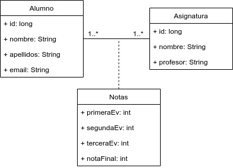

# Ejemplo 20 - Ejemplo de dos entidades con una asociación ManyToMany (tratamiento bidireccional) y atributos extra

Partimos desde el ejemplo [anterior]()

## ¿Cuál es nuestro modelo de datos?

 

## Asociación `@ManyToMany` con atributos extra

La implementación de una asociación _muchos-a-muchos_ simple ha resultado ser muy sencilla (incluso en el tratamiento bidireccional). Sin embargo, para **añadir atributos extra**, necesitamos crear una nueva entidad, y hacer uso de algunas anotaciones nuevas.

## Algo de teoría

### Tipos `Embeddable`

En alguna ocasión, puede que interesarnos agrupar un cierto conjunto de valores: supongamos que queremos manejar la `Localizacion` de una determinada `Oficina`. Una localización está formada por una `direccion`, una `ciudad` y un `pais`. Realmente no queremos tratar una `Localizacion` como una entidad; su ciclo de vida siempre estará asociado al de la `Oficina` correspondiente. Nos puede interesar agruparlo todo, por ejemplo, para dar un tratamiento integral. 

JPA nos ofrece la anotación `@Embeddable`, que nos permite generar una clase que será _encajable_ ( _incrustable_, _embebible_) en otra entidad.

```java
@Embeddable
public class Localizacion {

	private String direccion;
	
	private String ciudad;
	
	private String pais;

	// Resto del código
}

@Entity
public class Oficina {

	@Id
	@GeneratedValue(strategy = GenerationType.AUTO)
	private long id;

	private Localizacion localizacion;
	
	private String telefonoContacto;
	
	// Resto del código

}
```

Como podemos observar, un elemento interesante de la clase anotada con `Embeddable` es que no tiene un atributo identificador (`@Id`).

El DDL generado sería algo parecido a esto:

```sql
create table Oficina (
	id bigint not null,
	direccion varchar(255),
	ciudad varchar(255),
	pais varchar(255),
	telefonoContacto varchar(255),
	primary key (id)
)	
```

### Identificadores compuestos

Hasta ahora, todas nuestras entidades han estado identificadas mediante un _identificador_ (valga la redundancia) que ha sido simple. De hecho, siempre hemos utilizado el siguente fragmento de código:

```java
@Id
@GeneratedValue(strategy=GenerationType.AUTO)
private long id;
```

En determinados contextos podemos necesitar otro tipo de identificador, compuesto por más de un atributo. 

JPA nos ofrece alguna estrategia para poder implementar esto, siempre y cuando se cumplan las siguientes reglas:

- El identificador compuesto debe estar representado por una _clase de clave primaria_. Esta se puede definir con las anotaciones `@EmbeddId` o con la anotación `@IdClass`.
- La _clase de clave primaria_ debe ser pública y debe tener un constructor público sin argumentos.
- La _clase de clave primaria_ debe ser serializable.
- La _clase de clave primaria_ debe definir los métodos `equals` y `hashCode` de forma consistente.

Los atributo que forman esta composición pueden ser básicos, compuestos o anotados con `@ManyToOne`.  

Veamos el siguiente [ejemplo de la documentación de Hibernate](http://docs.jboss.org/hibernate/orm/5.4/userguide/html_single/Hibernate_User_Guide.html#identifiers-composite-aggregated)

```java
@Entity(name = "SystemUser")
public static class SystemUser {

	@EmbeddedId
	private PK pk;

	private String name;

	//Getters and setters are omitted for brevity
}

@Embeddable
public static class PK implements Serializable {

	private String subsystem;

	private String username;

	public PK(String subsystem, String username) {
		this.subsystem = subsystem;
		this.username = username;
	}

	public PK() {
	}

}
```

### Uso de la anotación `@MapsId`

JPA 2.0 agregó soporte para identificadores derivados que permiten que una entidad tome prestado el identificador de una asociación de muchos a uno o de uno a uno. La anotación `@MapsId` también puede hacer referencia a columnas de un identificador `@EmbeddedId` (como va a ser nuestro caso).


## Implementación de la solución

### ¿Qué tenemos hasta ahora?

Tenemos implementadas ambas entidades, con sus respectivos repositorios y servicios. Además, el tratamiento de la asociación que tenemos implementado es bidireccional.


### Paso 1: Creamos la nueva clase que va a _mapear_ la clave primaria de la asociación _muchos-a-muchos_.

```java
@Data @NoArgsConstructor
@Embeddable
public class NotasPK implements Serializable {
	
	private static final long serialVersionUID = 8682909319466153524L;
	
	private long alumno_id;
	
	private long asignatura_id;	

}

```

Como podemos comprobar, cumplimos con las reglas estipuladas por JPA:

- Clase pública
- Implementa serializable
- Gracias a Lombok, tenemos un constructor público sin argumentos, y la implementación de `equals` y `hashCode`.

### Paso 2: Creamos la nuevo entidad que va a _mapear_ la asociación _muchos-a-muchos_.

```java
@Entity
public class Notas {
	
	@EmbeddedId
	private NotasPK id;
	
	@ManyToOne
	@MapsId("alumno_id")
	@JoinColumn(name="alumno_id")
	private Alumno alumno;	
	
	
	@ManyToOne
	@MapsId("asignatura_id")
	@JoinColumn(name="asignatura_id")
	private Asignatura asignatura;
	
	private int primeraEv;
	private int segundaEv;
	private int terceraEv;
	private int notaFinal;
	
	
	public Notas(Alumno alumno, Asignatura asignatura, int primeraEv, int segundaEv, int terceraEv, int notaFinal) {
		this.alumno = alumno;
		this.asignatura = asignatura;
		this.primeraEv = primeraEv;
		this.segundaEv = segundaEv;
		this.terceraEv = terceraEv;
		this.notaFinal = notaFinal;
	}	

}

``` 

Como podemos observar, vamos a **romper nuestra asociación `@ManyToMany` para utilizar dos conjuntos de asociaciónes  `@ManyToOne` + `@OneToMany`.** En esta entidad tenemos las asociaciones `@ManyToOne`.

Como hemos visto anteriormente en la teoría, podemos destacar dos cosas:

- Usamos `@EmbeddId` para marcar la clave primaria (en lugar de usar `@Id`, como veníamos haciendo hasta ahora`).
- Marcamos los campos de tipo `Alumno` y `Asignatura` con `@MapsId`. Con esto conseguimos vincular cada campo con una parte de la clave primaria, y son las claves externas de una asociación _muchos-a-uno_.


### Paso 3: Modificación de las clases `Alumno` y `Asignatura`.

Ahora, tenemos que modificar ambas clases para transformar nuestra asociación `@ManyToMany` en el conjunto `@ManyToOne` + `@OneToMany`. En `Alumno` y `Asignatura` irán los extremos `@OneToMany`.

```java

```


