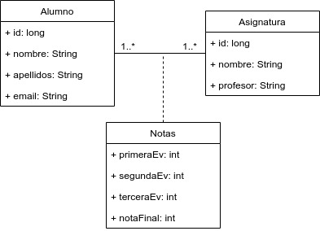

# Ejemplo 21 - Ejemplo de dos entidades con una asociación ManyToMany y atributos extra (versión 2)

Partimos desde el [ejemplo 19](https://github.com/lmlopezmagana/bbdd-2019/tree/master/19_AsociacionesManyToMany-Bidi).

## ¿Cuál es nuestro modelo de datos?

 

## ¿Qué otra solución podemos aportar?

Para solucionar el problema esta vez, vamos a **romper** nuestra asociación  `@ManyToMany` como dos colecciones de asociaciones `@ManyToOne` y `@OneToMany` en una nueva entidad. A diferencia de la anterior, en este caso no vamos a utilizar una clave primaria compuesta, sino una simple. 


## Implementación de la solución

### ¿Qué tenemos hasta ahora?

Tenemos implementadas ambas entidades, con sus respectivos repositorios y servicios. Además, el tratamiento de la asociación que tenemos implementado es bidireccional.


### Paso 1: Creamos la nuevo entidad que va a _mapear_ la asociación _muchos-a-muchos_.

```java
@Entity
public class Notas {

	@Id
	@GeneratedValue(strategy=GenerationType.AUTO)
	private long id;	
	
	@ManyToOne
	@JoinColumn(name="alumno_id")
	private Alumno alumno;	
	
	
	@ManyToOne
	@JoinColumn(name="asignatura_id")
	private Asignatura asignatura;
	
	private int primeraEv;
	private int segundaEv;
	private int terceraEv;
	private int notaFinal;
	
	
	public Notas(Alumno alumno, Asignatura asignatura, int primeraEv, int segundaEv, int terceraEv, int notaFinal) {
		this.alumno = alumno;
		this.asignatura = asignatura;
		this.primeraEv = primeraEv;
		this.segundaEv = segundaEv;
		this.terceraEv = terceraEv;
		this.notaFinal = notaFinal;
	}	

}

``` 

Como podemos observar, vamos a **romper nuestra asociación `@ManyToMany` para utilizar dos conjuntos de asociaciones  `@ManyToOne` + `@OneToMany`.** En esta entidad tenemos las asociaciones `@ManyToOne`.


### Paso 2: Modificación de las clases `Alumno` y `Asignatura`.

Ahora, tenemos que modificar ambas clases para transformar nuestra asociación `@ManyToMany` en el conjunto `@ManyToOne` + `@OneToMany`. En `Alumno` y `Asignatura` irán los extremos `@OneToMany`.

```java
@Entity
public class Alumno {
	
	@Id
	@GeneratedValue(strategy=GenerationType.AUTO)
	private long id;
	
	private String nombre;
	private String apellidos;
	private String email;
	
	@OneToMany(mappedBy="alumno")
	private List<Notas> notas = new ArrayList<>();
	
	// Resto de métodos y atributos

}

```

```java
@Entity
public class Asignatura {

	@Id
	@GeneratedValue(strategy = GenerationType.AUTO)
	private long id;
	
	private String nombre;
	private String profesor;
	
	@OneToMany(mappedBy="asignatura")
	private List<Notas> notas = new ArrayList<>();
	
	// Resto del código
}
```

### Paso 3: Creación del repositorio y servicios para la clase `Notas`.

Lo realizamos como en otras ocasiones:

```java
public interface NotasRepository extends JpaRepository<Notas, Long>{

}
```

```java
@Service
public class NotasServicio extends BaseService<Notas, Long, NotasRepository>{

}
```
### Paso 4: Utilización de la nueva clase de asociación

```java
Alumno antonio = new Alumno("Antonio", "Pérez", "antonio.perez@gmail.com");
alumnoServicio.save(antonio);
			
Asignatura basesDeDatos = new Asignatura("Bases de datos", "Luis Miguel López");
asignaturaServicio.save(basesDeDatos);
			
Notas notaAntonio = new Notas();
notaAntonio.setAlumno(antonio);
notaAntonio.setAsignatura(basesDeDatos);
notaAntonio.setPrimeraEv(10);
notaAntonio.setSegundaEv(10);
notaAntonio.setTerceraEv(10);
notaAntonio.setNotaFinal(10);
notasServicio.save(notaAntonio);
```

### Paso 5: Tratamiento bidireccional y no olvidar evitar referencias circulares

Como hemos comprobado, hemos pasado **de una asociación `@ManyToMany` bidireccional** a **dos asociaciones `@ManyToOne` + `@OneToMany`**. No hemos implementado el tratamiento bidireccional a través de métodos _helpers_ por no estimarlo conveniente para este ejemplo. Quedaría **a elección del usuario el poder hacerlo**.

Sí que necesitaríamos excluir las listas en los métodos `equals`, `hashCode` y `toString` para evitar referencias circulares.


